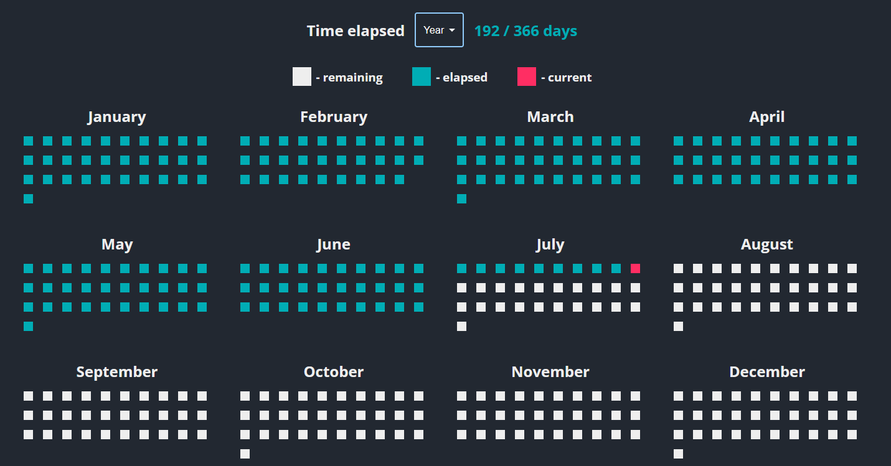

# Time 
Visualise the time on different scales to get a better understanding of how you spend it. 

## Live Demo
[https://github.com/Sufferal/time/](https://github.com/Sufferal/time/)

## Goal
Sometimes you get lost in the daily activities and don't realize how much time you spend on them. When you take a bird's eye view of your time, it reminds you how valueable it is and how you should spend it wisely.

## Quick Start 
To run the project locally, follow the steps below:
1. Clone the repository
```
git clone https://github.com/Sufferal/time.git 
```
2. Install front-end dependencies
``` 
npm install
```
3. Start the front-end server
```
npm run dev
```
4. Open the browser and navigate to [http://localhost:5173](http://localhost:5173)

## Usage
### Today


### Week


### Month


### Year


### Life
